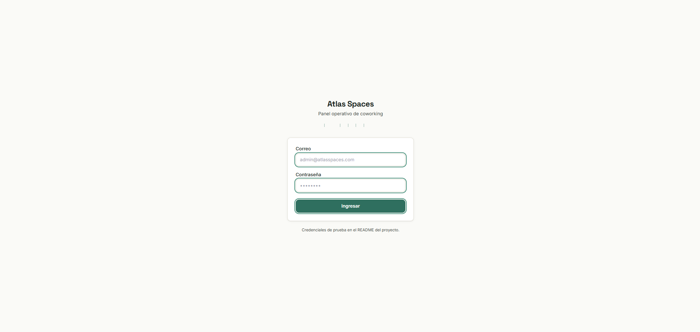
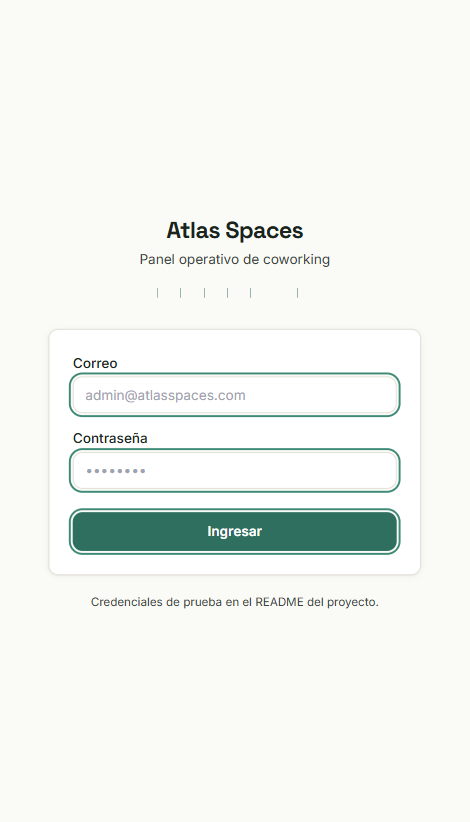
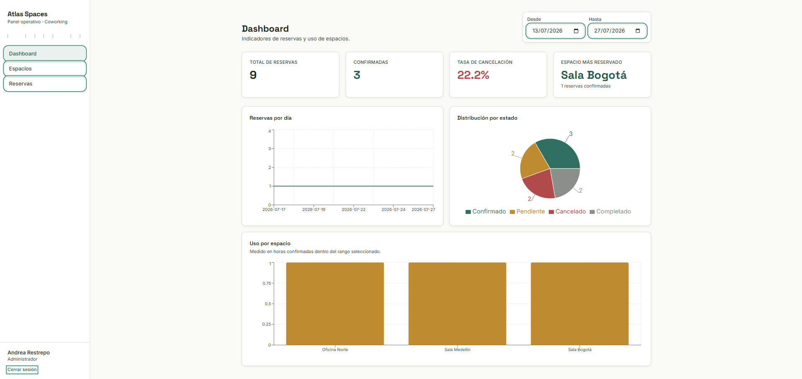
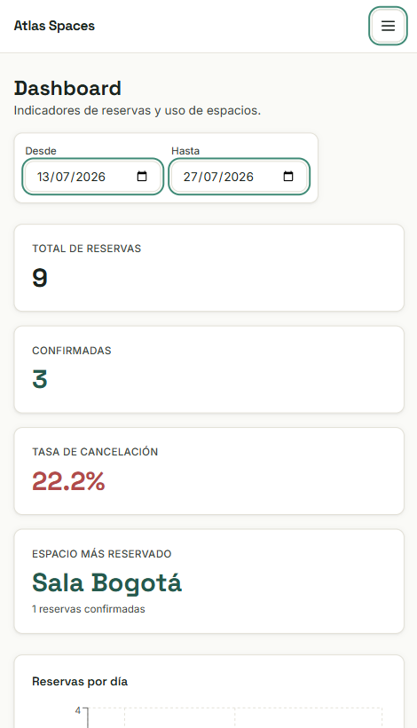
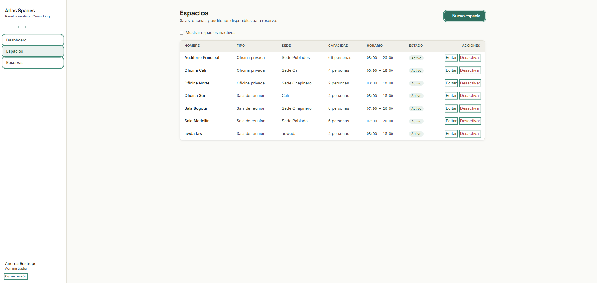
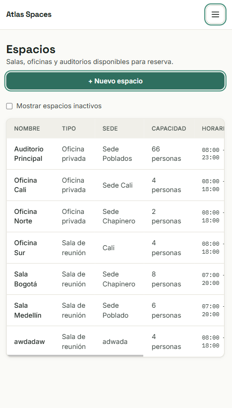
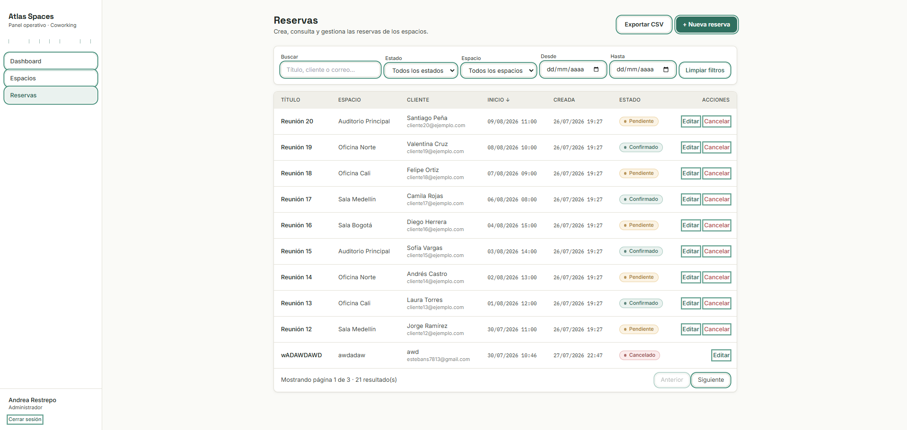
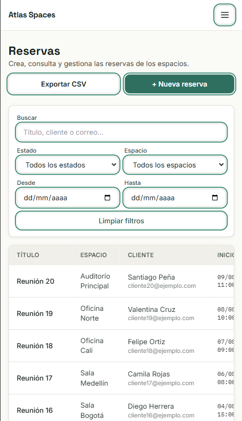

# Atlas Spaces — Plataforma de reservas de coworking

Prueba técnica Full Stack para Quantum Infinity Technologies S.A.S. Aplicación completa (backend + frontend + base de datos) para administrar espacios de coworking y sus reservas.

## Descripción y arquitectura

- **Backend**: Node.js + Express, API REST, MongoDB (Mongoose), autenticación con access token JWT + refresh token rotado en cookie httpOnly, autorización por rol, logging estructurado (pino) y documentación OpenAPI interactiva.
- **Frontend**: React + React Router + Tailwind CSS (Vite), consumiendo la API real (sin datos simulados), con renovación automática de sesión.
- **Base de datos**: MongoDB.
- **Contenedores**: Docker + Docker Compose (backend, frontend, MongoDB), con healthchecks y volumen persistente.

```
atlas-spaces/
├── backend/           # API REST (Node/Express/Mongoose)
│   ├── src/
│   │   ├── config/         # Conexión a MongoDB
│   │   ├── models/          # User, Space, Reservation, RefreshToken
│   │   ├── middleware/       # Auth JWT, manejo de errores, logging HTTP
│   │   ├── controllers/      # Lógica de cada recurso
│   │   ├── routes/           # Definición de endpoints
│   │   ├── docs/              # Especificación OpenAPI (Swagger UI en /api/docs)
│   │   ├── utils/            # Reglas de negocio, fechas, hash de tokens, logger
│   │   └── seed/              # Script de datos iniciales
│   └── tests/                # Pruebas Jest + Supertest
├── frontend/           # SPA (React + Vite + Tailwind)
│   ├── screenshots/       # Capturas de pantalla (ver sección más abajo)
│   └── src/
│       ├── api/               # Cliente Axios y llamadas a la API
│       ├── context/           # AuthContext (sesión + refresh automático)
│       ├── hooks/              # useAuth, useModalA11y (accesibilidad de modales)
│       ├── components/        # Layout, formularios, UI states (con pruebas Vitest)
│       └── pages/              # Login, Dashboard, Espacios, Reservas
├── docs/
│   └── postman_collection.json
├── docker-compose.yml
├── IA.md
└── README.md (este archivo)
```

## 🎥 Video demo

Para facilitar la evaluación del proyecto, se incluye un video donde se muestra el funcionamiento de la aplicación y se recorren las funcionalidades principales.

**Video de demostración:**
https://drive.google.com/file/d/1RdrLzfjs418-BcwTllXzyUHnuJVedvGh/view?usp=sharing
En el video se muestra:

- Inicio de sesión.
- Gestión de espacios.
- Gestión de reservas.
- Validaciones de negocio.
- Dashboard y funcionalidades principales.
- Exportación de reservas a CSV.
- Arquitectura, decisiones tomadas y uso de IA.

## 📸 Capturas de pantalla

Vista de escritorio y vista responsive (móvil) de cada pantalla principal.

### Login

| Escritorio | Móvil |
|---|---|
|  |  |

### Dashboard

| Escritorio | Móvil |
|---|---|
|  |  |

### Espacios

| Escritorio | Móvil |
|---|---|
|  |  |

### Reservas

| Escritorio | Móvil |
|---|---|
|  |  |

## Requisitos previos

- Para ejecución con Docker: **Docker** y **Docker Compose**.
- Para ejecución local sin Docker: **Node.js 20+** y una instancia de **MongoDB** corriendo localmente (o accesible por red).

## Instalación y ejecución con Docker (recomendado)

```bash
# Desde la raíz del proyecto
docker compose up --build
```

> ✅ **Verificado**: `docker compose up --build` se ejecutó de extremo a extremo (los 3 contenedores — frontend, backend y MongoDB — levantan correctamente) usando Docker Desktop.

Esto levanta 3 contenedores:

| Servicio  | URL                          | Descripción                    |
|-----------|------------------------------|---------------------------------|
| frontend  | http://localhost:5173        | Interfaz web (nginx)             |
| backend   | http://localhost:4000/api    | API REST                          |
| mongo     | localhost:27017              | Base de datos (volumen persistente) |

**Cargar los datos iniciales** (usuarios, espacios y reservas de ejemplo) — ejecutar en otra terminal, con los contenedores ya corriendo:

```bash
docker compose exec backend npm run seed
```

**Reiniciar / limpiar el entorno:**

```bash
docker compose down          # detiene los contenedores, conserva el volumen de datos
docker compose down -v       # detiene los contenedores y BORRA el volumen de MongoDB
docker compose up --build    # reconstruye y levanta de nuevo
```

## Instalación y ejecución local (sin Docker)

### 1. Backend

```bash
cd backend
cp .env.example .env
# Edite .env si su MongoDB local no usa la URI por defecto
npm install
npm run seed      # carga usuarios, espacios y reservas de ejemplo
npm run dev       # levanta la API en http://localhost:4000 con nodemon
```

### 2. Frontend

```bash
cd frontend
cp .env.example .env
npm install
npm run dev       # levanta la SPA en http://localhost:5173
```

Con ambos procesos corriendo, abra http://localhost:5173 en el navegador.

## Variables de entorno

### Backend (`backend/.env`)

| Variable                        | Descripción                                                                 | Ejemplo                                    |
|----------------------------------|-------------------------------------------------------------------------------|-----------------------------------------------|
| `PORT`                          | Puerto de la API                                                              | `4000`                                        |
| `MONGO_URI`                     | Cadena de conexión a MongoDB                                                  | `mongodb://localhost:27017/atlas_spaces`       |
| `JWT_SECRET`                    | Secreto para firmar los access tokens (JWT)                                    | *(valor aleatorio largo)*                      |
| `ACCESS_TOKEN_EXPIRES_IN`       | Duración del access token (vida corta a propósito)                             | `15m`                                          |
| `REFRESH_TOKEN_EXPIRES_IN_DAYS` | Duración en días del refresh token (cookie httpOnly, rotado en cada uso)         | `7`                                            |
| `FRONTEND_URL`                  | Origin exacto del frontend (obligatorio y específico: CORS + credentials no admite `*`) | `http://localhost:5173`                |
| `LOG_LEVEL`                     | Nivel de log de pino                                                          | `info`                                        |
| `NODE_ENV`                      | Entorno de ejecución                                                          | `development` / `production` / `test`         |

### Frontend (`frontend/.env`)

| Variable         | Descripción                                              | Ejemplo                                |
|------------------|-----------------------------------------------------------|------------------------------------------|
| `VITE_API_URL`   | URL base de la API, tal como la alcanza el navegador       | `http://localhost:4000/api`               |

## Credenciales de prueba (después de ejecutar el seed)

| Rol           | Correo                       | Contraseña   |
|---------------|-------------------------------|---------------|
| Administrador | `admin@atlasspaces.com`       | `Atlas2026!`  |
| Operador      | `operador@atlasspaces.com`    | `Atlas2026!`  |

## Comando de seed y comando de pruebas

```bash
# Seed (backend)
cd backend && npm run seed

# Pruebas automatizadas (backend)
cd backend && npm test

# Pruebas automatizadas (frontend)
cd frontend && npm test
```

> ✅ **Verificado**: ambas suites se ejecutaron de extremo a extremo, con MongoDB real (`mongodb-memory-server` descarga y levanta un motor de MongoDB genuino, temporal y aislado, no una simulación). Resultado:
> - **Backend**: 3 suites, **24/24 pruebas pasando** (`auth.test.js`, `reservations.test.js`, `dateUtils.unit.test.js`).
> - **Frontend**: 4 archivos, **19/19 pruebas pasando** (`StatusBadge`, `Pagination`, `ConfirmDialog`, `AuthContext`).
>
> Nota: la primera ejecución de `npm test` en el backend puede tardar un poco más de lo normal, porque `mongodb-memory-server` descarga el binario de MongoDB la primera vez (requiere acceso a internet en ese momento; luego queda en caché local). No requiere tener el backend ni el frontend corriendo en otra terminal — cada suite levanta su propia app/base de datos en memoria de forma autónoma.

### Alcance de las pruebas automatizadas

**Backend (Jest + Supertest, en `backend/tests/`)**

| Archivo | Qué cubre |
|---|---|
| `auth.test.js` | Login con credenciales válidas/inválidas, acceso a ruta protegida con y sin token, token inválido, ciclo completo de refresh token (emisión, rotación, reutilización rechazada), logout revocando la sesión, y autorización por rol (admin vs. operador) al crear espacios. |
| `reservations.test.js` | Las 4 reglas de negocio mínimas exigidas por la prueba: **(1)** rechazo de una reserva superpuesta (409 Conflict), **(2)** aceptación de dos reservas consecutivas (una inicia justo cuando termina la otra), **(3)** validación de capacidad y de horario del espacio, **(4)** validación de fecha de inicio anterior a la de fin y de fechas pasadas. Incluye además un caso de edición que confirma que la reserva no se compara contra sí misma al revalidar el solapamiento. |
| `dateUtils.unit.test.js` | Conversión de fechas entre hora de Bogotá (UTC-5) y UTC, incluyendo un caso "ida y vuelta" para confirmar que la conversión no pierde información. |

**Frontend (Vitest + React Testing Library, en `frontend/src/`)**

| Archivo | Qué cubre |
|---|---|
| `components/StatusBadge.test.jsx` | Que cada estado de reserva (pendiente/confirmado/cancelado/completado) muestre la etiqueta correcta, y que un estado desconocido no rompa el componente. |
| `components/ConfirmDialog.test.jsx` | Accesibilidad del modal: no renderiza si `open` es falso, se expone como `dialog` correctamente etiquetado, el foco se mueve automáticamente al botón "Cancelar" al abrirse (para que la acción no destructiva sea la predeterminada), `Escape` cierra el diálogo, y los botones quedan deshabilitados mientras `loading` es verdadero. |
| `components/Pagination.test.jsx` | Los botones "Anterior"/"Siguiente" se deshabilitan correctamente en los extremos, disparan `onChange` con la página correcta, y el mensaje "Sin resultados" aparece cuando el total es cero. |
| `context/AuthContext.test.jsx` | Que la sesión se restaure al montar la app si el refresh token (cookie) sigue siendo válido, que el estado pase a `guest` si no lo es, y que login/logout actualicen el estado global de autenticación correctamente. |

Estas pruebas se concentraron en la lógica de negocio y en los componentes con estado más propensos a errores silenciosos (fechas, solapamientos de horario, permisos, accesibilidad de modales); no incluyen pruebas end-to-end de la interfaz completa (por ejemplo, con Playwright o Cypress simulando un flujo de usuario de principio a fin), lo cual queda documentado como mejora futura más abajo.

## Endpoints / documentación de API

Hay dos formas de explorar la API:

1. **Swagger UI interactivo**, servido por el propio backend: con la API corriendo, abrir **http://localhost:4000/api/docs**.
2. **Colección Postman** incluida en [`docs/postman_collection.json`](docs/postman_collection.json). Impórtela en Postman y configure la variable `baseUrl` (por defecto `http://localhost:4000/api`) y `token` (obtenido del endpoint de login).

Resumen de endpoints principales:

```
POST   /api/auth/login
POST   /api/auth/refresh              (renueva el access token con la cookie httpOnly)
POST   /api/auth/logout               (invalida el refresh token actual)
GET    /api/auth/me

GET    /api/spaces
GET    /api/spaces/:id
POST   /api/spaces                    (admin)
PUT    /api/spaces/:id                (admin)
PATCH  /api/spaces/:id/deactivate     (admin)
PATCH  /api/spaces/:id/reactivate     (admin)

GET    /api/reservations              (page, limit, status, spaceId, from, to, search, sortBy, sortOrder)
GET    /api/reservations/export       (mismos filtros que el listado, exporta CSV)
GET    /api/reservations/:id
POST   /api/reservations
PUT    /api/reservations/:id
PATCH  /api/reservations/:id/cancel

GET    /api/analytics/summary?from=&to=
GET    /api/analytics/reservations-by-day?from=&to=
GET    /api/analytics/status-distribution?from=&to=
GET    /api/analytics/space-usage?from=&to=

GET    /api/health
```

Valores válidos de `status`: `pending`, `confirmed`, `cancelled`, `completed`.

## Supuestos y decisiones relevantes

1. **Zona horaria (America/Bogota)**: Colombia usa UTC-5 fijo, sin horario de verano. En vez de agregar una dependencia de zonas horarias (IANA tz data), se implementó una conversión explícita de offset fijo (`backend/src/utils/dateUtils.js`), documentada en el propio código. Las fechas se guardan en MongoDB en UTC (comportamiento nativo); el frontend y el CSV siempre muestran/reciben la hora en Bogotá.
2. **Búsqueda (`search`)**: se implementó con regex (no `$text` de Mongo) para permitir coincidencias parciales (substring) en título, cliente y correo, que es el comportamiento esperado por un usuario al escribir en un buscador.
3. **Desactivar un espacio con reservas futuras** (decisión no definida explícitamente en el documento): al desactivar un espacio, sus reservas futuras pendientes/confirmadas **no se cancelan automáticamente**; solo se bloquean nuevas reservas sobre ese espacio. El backend devuelve una advertencia (`warning`) con el conteo de reservas futuras afectadas, para que el administrador decida manualmente si cancelarlas. Se prefirió no destruir compromisos ya adquiridos con clientes.
4. **Edición de reservas y fechas pasadas**: al editar una reserva sin modificar su horario/espacio/asistentes (por ejemplo, solo agregar una nota o cambiar el estado), no se exige que la fecha de inicio sea futura — de lo contrario sería imposible, por ejemplo, marcar como "Completada" una reserva que ya pasó.
5. **Roles**: se asumió que tanto administrador como operador pueden crear, editar y cancelar reservas por igual (según el documento), y que solo el administrador gestiona espacios.
6. **Cancelar reserva**: se expone además como acción explícita (`PATCH /:id/cancel`), complementaria al `PUT` genérico, porque es la acción más frecuente y de menor riesgo (libera el horario en vez de ocuparlo, por lo que no requiere re-validar solapamiento).
7. **Sesión (access + refresh token)**: el access token JWT vive poco tiempo (15 min) y se mantiene en memoria en el frontend; la sesión persiste mediante un refresh token de mayor duración, guardado como cookie httpOnly y como hash (no en texto plano) en la base de datos, rotado en cada uso. Se prefirió este esquema sobre un único JWT de larga duración en `localStorage` para reducir la ventana de exposición ante un eventual XSS.

## Limitaciones conocidas y mejoras que se implementarían con más tiempo

- **Pruebas de frontend**: existen pruebas con Vitest para componentes puntuales (`Pagination`, `StatusBadge`, `ConfirmDialog`) y para `AuthContext`, pero no cubren flujos completos de página (por ejemplo, crear una reserva de principio a fin simulando la interacción del usuario). Sería la siguiente prioridad de testing.
- **CI**: no se configuró integración continua (GitHub Actions) por alcance, aunque el proyecto está estructurado para agregarla fácilmente (`npm test` en backend y frontend ya son comandos únicos, y ambos se verificaron pasando de extremo a extremo).
- **Accesibilidad**: se implementó manejo de foco, cierre con Escape y roles ARIA en los modales (`useModalA11y`), además de labels y contraste cuidados en los formularios, pero no se hizo una auditoría completa con lector de pantalla ni navegación por teclado exhaustiva de punta a punta.
- **Refactor de `ReservationsPage`**: es el componente más grande del frontend (filtros, tabla, paginación, modal y exportación en un solo archivo). Con más tiempo se dividiría en subcomponentes más pequeños para facilitar su prueba y lectura.